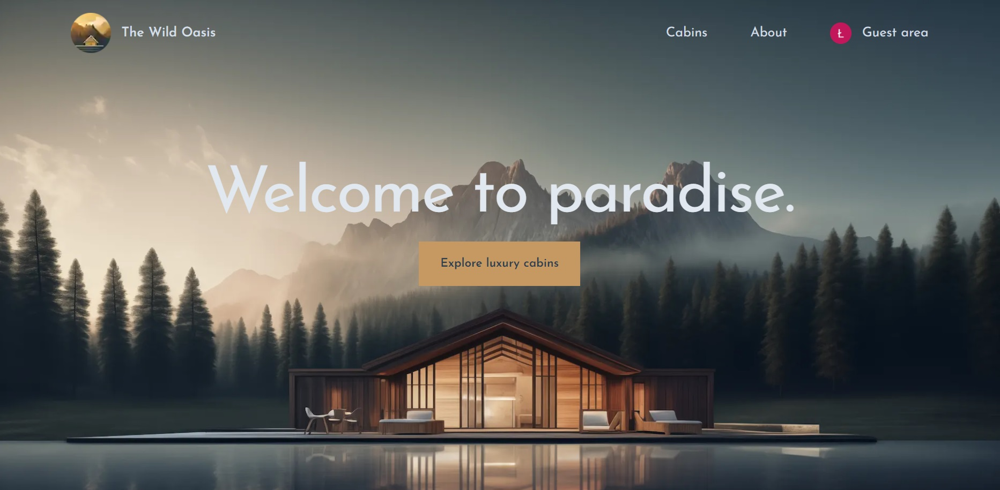
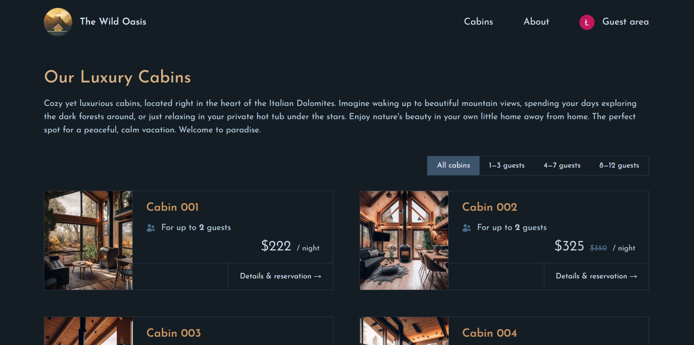
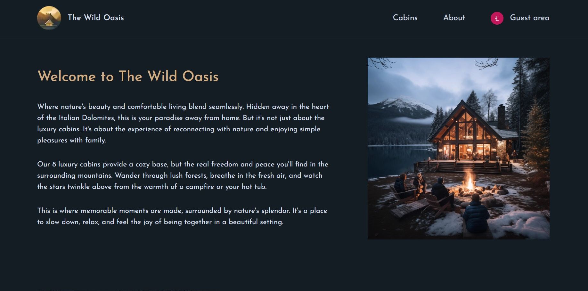
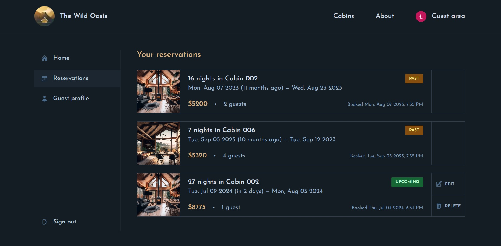

# The Wild Oasis Website

## About the project

**This is a second main project from The Ultimate React Course 2024: React, Next, Redux & More by Jonas Schmedtmann** - https://www.udemy.com/course/the-ultimate-react-course/

The project is a simulation of a hotel website, allows you to reserve cabins, register and login with OAuth and modify user data. This website works with the first app from this course <a href="https://github.com/JudiJudi6/The-wild-oasis">The Wild Oasis</a>

## Build with

## Pictures

## How to run

Supabase shuts down the database after 2 weeks of inactivity so the project will probably not function properly.

1. Clone the repo
   `git clone https://github.com/JudiJudi6/The-Wild-Oasis-website.git`

2. Install NPM packages
   `npm i`

3. To run app
   `npm run dev`
